# Gang of Four Design Patterns

Reference for all 23 patterns from *Design Patterns: Elements of Reusable Object-Oriented Software* (Gamma, Helm, Johnson, Vlissides). Each entry includes intent, a local example, UML, and a link to the C++ implementation.

See [README.md](README.md) for build instructions and the full pattern index.

## Table of Contents

**Creational**
- [Abstract Factory](#abstract-factory)
- [Builder](#builder)
- [Factory Method](#factory-method)
- [Prototype](#prototype)
- [Singleton](#singleton)

**Structural**
- [Adapter](#adapter)
- [Bridge](#bridge)
- [Composite](#composite)
- [Decorator](#decorator)
- [Facade](#facade)
- [Flyweight](#flyweight)
- [Proxy](#proxy)

**Behavioral**
- [Chain of Responsibility](#chain-of-responsibility)
- [Command](#command)
- [Interpreter](#interpreter)
- [Iterator](#iterator)
- [Mediator](#mediator)
- [Memento](#memento)
- [Observer](#observer)
- [State](#state)
- [Strategy](#strategy)
- [Template Method](#template-method)
- [Visitor](#visitor)

---

## Creational

### Abstract Factory

**Intent:** Provide an interface for creating families of related objects without specifying their concrete classes.

**Example:** Database connectivity — MongoDB, PostgreSQL, and SQL each supply matching `Connection`, `QueryBuilder`, and `Transaction` implementations.

**UML**

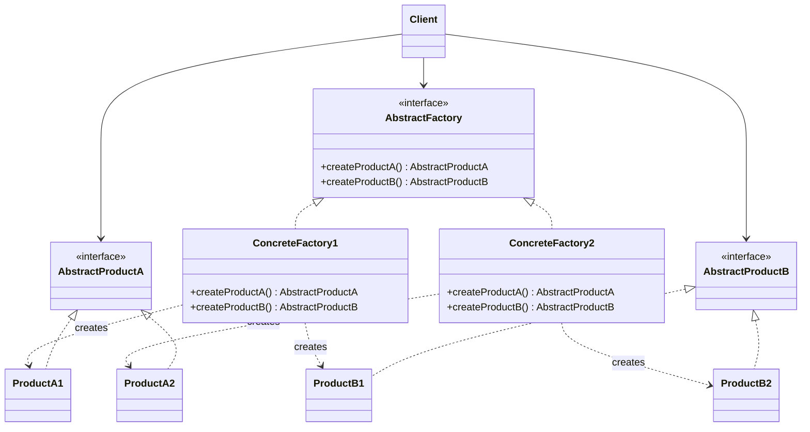
```mermaid
classDiagram
    class AbstractFactory {
        <<interface>>
        +createProductA() AbstractProductA
        +createProductB() AbstractProductB
    }
    class ConcreteFactory1 {
        +createProductA() AbstractProductA
        +createProductB() AbstractProductB
    }
    class ConcreteFactory2 {
        +createProductA() AbstractProductA
        +createProductB() AbstractProductB
    }
    class AbstractProductA {
        <<interface>>
    }
    class AbstractProductB {
        <<interface>>
    }
    class ProductA1
    class ProductA2
    class ProductB1
    class ProductB2
    class Client

    AbstractFactory <|.. ConcreteFactory1
    AbstractFactory <|.. ConcreteFactory2
    AbstractProductA <|.. ProductA1
    AbstractProductA <|.. ProductA2
    AbstractProductB <|.. ProductB1
    AbstractProductB <|.. ProductB2
    ConcreteFactory1 ..> ProductA1 : creates
    ConcreteFactory1 ..> ProductB1 : creates
    ConcreteFactory2 ..> ProductA2 : creates
    ConcreteFactory2 ..> ProductB2 : creates
    Client --> AbstractFactory
    Client --> AbstractProductA
    Client --> AbstractProductB
```

**Implementation:** [`Creational/Abstract_Factory`](Creational/Abstract_Factory) — `make` → `./abstract_factory`

---

### Builder

**Intent:** Separate the construction of a complex object from its representation so the same construction process can create different representations.

**Example:** A fluent `PcBuilder` assembles gaming and office PCs with different part configurations.

**UML**

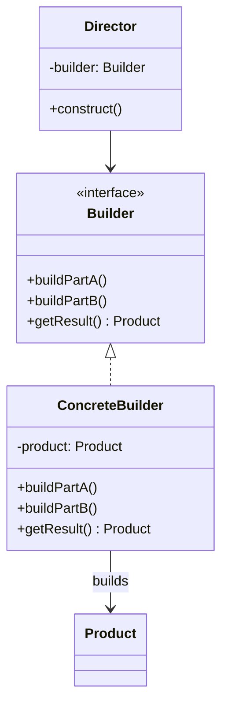
```mermaid
classDiagram
    class Builder {
        <<interface>>
        +buildPartA()
        +buildPartB()
        +getResult() Product
    }
    class ConcreteBuilder {
        -product: Product
        +buildPartA()
        +buildPartB()
        +getResult() Product
    }
    class Director {
        -builder: Builder
        +construct()
    }
    class Product

    Builder <|.. ConcreteBuilder
    Director --> Builder
    ConcreteBuilder --> Product : builds
```

**Implementation:** [`Creational/Builder`](Creational/Builder) — `make` → `./builder`

---

### Factory Method

**Intent:** Define an interface for creating an object, but let subclasses decide which class to instantiate.

**Example:** `DocumentFactory` subclasses create PDF, Word, or HTML documents through a shared `createDocument()` hook.

**UML**

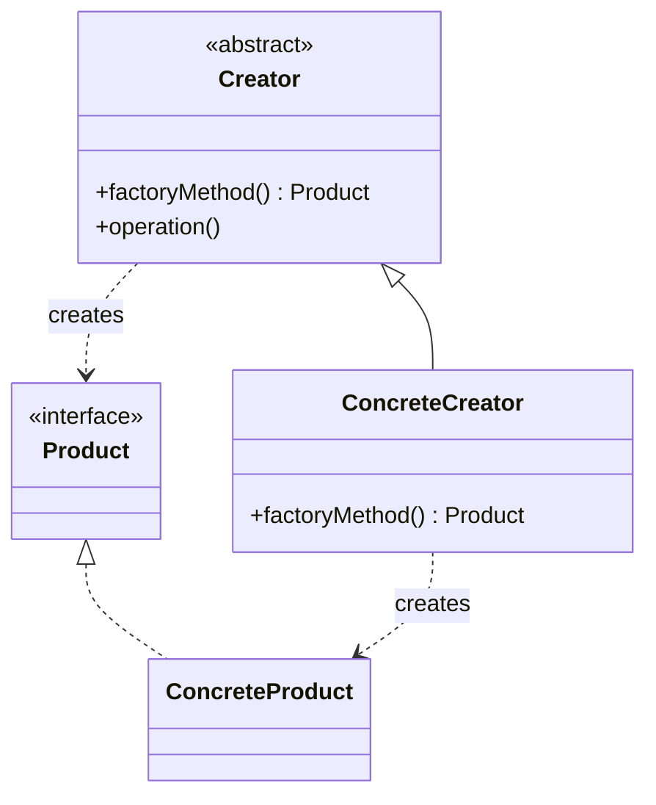
```mermaid
classDiagram
    class Creator {
        <<abstract>>
        +factoryMethod() Product
        +operation()
    }
    class ConcreteCreator {
        +factoryMethod() Product
    }
    class Product {
        <<interface>>
    }
    class ConcreteProduct

    Creator <|-- ConcreteCreator
    Product <|.. ConcreteProduct
    Creator ..> Product : creates
    ConcreteCreator ..> ConcreteProduct : creates
```

**Implementation:** [`Creational/Factory_Method`](Creational/Factory_Method) — `make` → `./factory_method`

---

### Prototype

**Intent:** Specify the kinds of objects to create using a prototypical instance, and create new objects by copying this prototype.

**Example:** An `ObjectSpawner` clones registered game prototypes (enemy, boss, NPC) instead of constructing each type from scratch.

**UML**

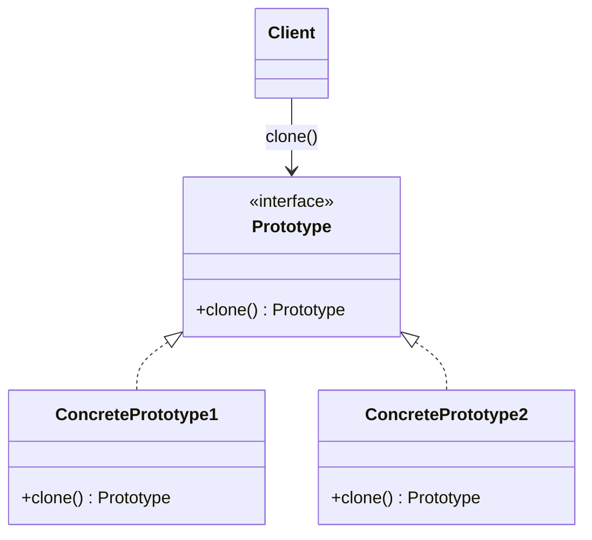
```mermaid
classDiagram
    class Prototype {
        <<interface>>
        +clone() Prototype
    }
    class ConcretePrototype1 {
        +clone() Prototype
    }
    class ConcretePrototype2 {
        +clone() Prototype
    }
    class Client

    Prototype <|.. ConcretePrototype1
    Prototype <|.. ConcretePrototype2
    Client --> Prototype : clone()
```

**Implementation:** [`Creational/Prototype`](Creational/Prototype) — `make` → `./prototype`

---

### Singleton

**Intent:** Ensure a class has only one instance and provide a global point of access to it.

**Example:** A thread-safe `Logger` exposes `getInstance()` and rejects copy and assignment.

**UML**

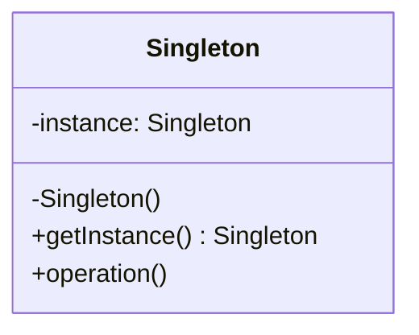
```mermaid
classDiagram
    class Singleton {
        -instance: Singleton
        -Singleton()
        +getInstance() Singleton
        +operation()
    }
```

**Implementation:** [`Creational/Singleton`](Creational/Singleton) — `make` → `./logger`

---

## Structural

### Adapter

**Intent:** Convert the interface of a class into another interface clients expect.

**Example:** `StripeAdapter` and `PayPalAdapter` wrap third-party payment APIs behind a common `PaymentProcessor` interface.

**UML**

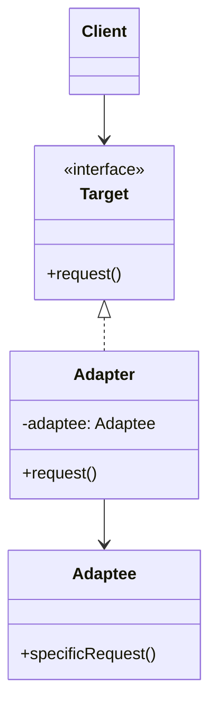
```mermaid
classDiagram
    class Target {
        <<interface>>
        +request()
    }
    class Adapter {
        -adaptee: Adaptee
        +request()
    }
    class Adaptee {
        +specificRequest()
    }
    class Client

    Target <|.. Adapter
    Adapter --> Adaptee
    Client --> Target
```

**Implementation:** [`Structural/Adapter`](Structural/Adapter) — `make` → `./app`

---

### Bridge

**Intent:** Decouple an abstraction from its implementation so the two can vary independently.

**Example:** `EmailNotification` and `SMSNotification` are paired with `GmailSender` or `TwilioSender` without subclass explosion.

**UML**

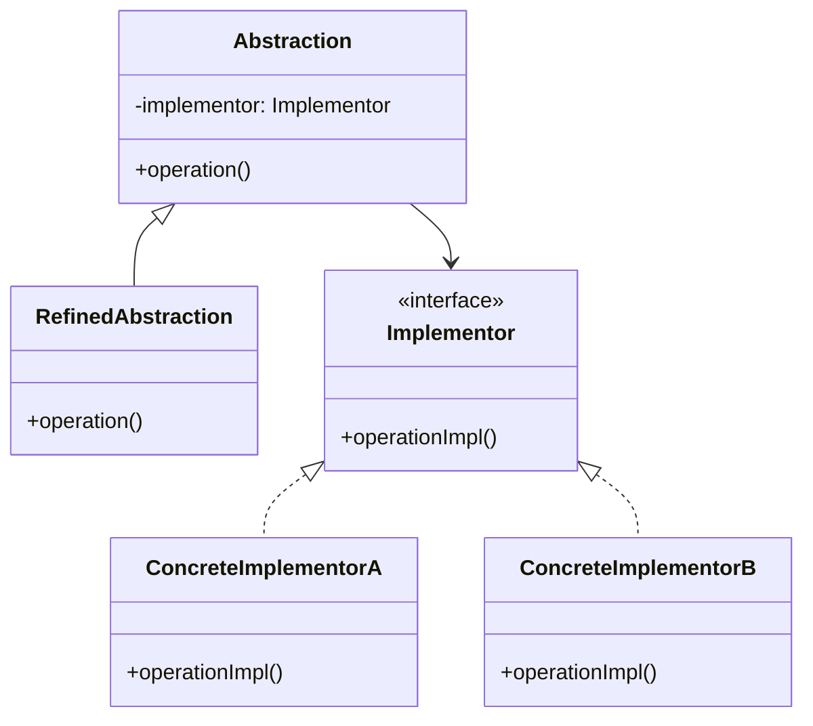
```mermaid
classDiagram
    class Abstraction {
        -implementor: Implementor
        +operation()
    }
    class RefinedAbstraction {
        +operation()
    }
    class Implementor {
        <<interface>>
        +operationImpl()
    }
    class ConcreteImplementorA {
        +operationImpl()
    }
    class ConcreteImplementorB {
        +operationImpl()
    }

    Abstraction <|-- RefinedAbstraction
    Implementor <|.. ConcreteImplementorA
    Implementor <|.. ConcreteImplementorB
    Abstraction --> Implementor
```

**Implementation:** [`Structural/Bridge`](Structural/Bridge) — `make` → `./bridge`

---

### Composite

**Intent:** Compose objects into tree structures to represent part-whole hierarchies. Clients treat individual objects and compositions uniformly.

**Example:** A file-system tree of `File` leaves and `Folder` composites supports uniform traversal and operations.

**UML**

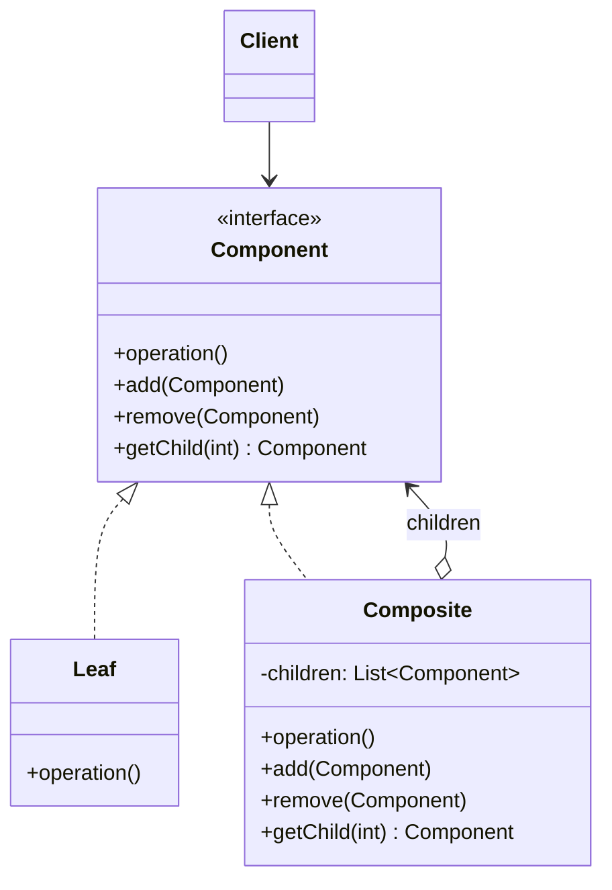
```mermaid
classDiagram
    class Component {
        <<interface>>
        +operation()
        +add(Component)
        +remove(Component)
        +getChild(int) Component
    }
    class Leaf {
        +operation()
    }
    class Composite {
        -children: List~Component~
        +operation()
        +add(Component)
        +remove(Component)
        +getChild(int) Component
    }
    class Client

    Component <|.. Leaf
    Component <|.. Composite
    Composite o--> Component : children
    Client --> Component
```

**Implementation:** [`Structural/Composite`](Structural/Composite) — `make` → `./composite`

---

### Decorator

**Intent:** Attach additional responsibilities to an object dynamically. Decorators provide a flexible alternative to subclassing for extending functionality.

**Example:** UI components are wrapped with `Border`, `Shadow`, `Indent`, and `Animation` decorators at runtime.

**UML**

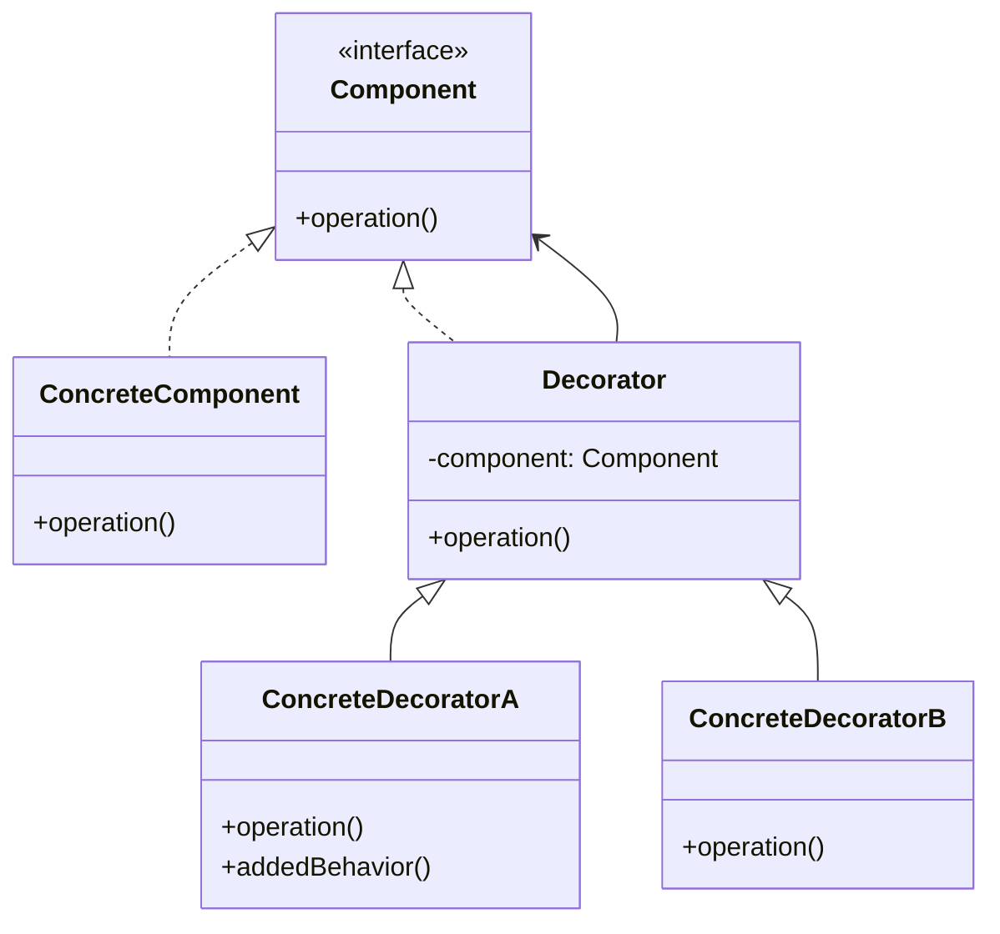
```mermaid
classDiagram
    class Component {
        <<interface>>
        +operation()
    }
    class ConcreteComponent {
        +operation()
    }
    class Decorator {
        -component: Component
        +operation()
    }
    class ConcreteDecoratorA {
        +operation()
        +addedBehavior()
    }
    class ConcreteDecoratorB {
        +operation()
    }

    Component <|.. ConcreteComponent
    Component <|.. Decorator
    Decorator <|-- ConcreteDecoratorA
    Decorator <|-- ConcreteDecoratorB
    Decorator --> Component
```

**Implementation:** [`Structural/Decorator`](Structural/Decorator) — `make` → `./decorator`

---

### Facade

**Intent:** Provide a unified interface to a set of interfaces in a subsystem. Define a higher-level interface that makes the subsystem easier to use.

**Example:** `SmartHomeFacade` coordinates lights, thermostat, and security subsystems behind one `arriveHome()` call.

**UML**

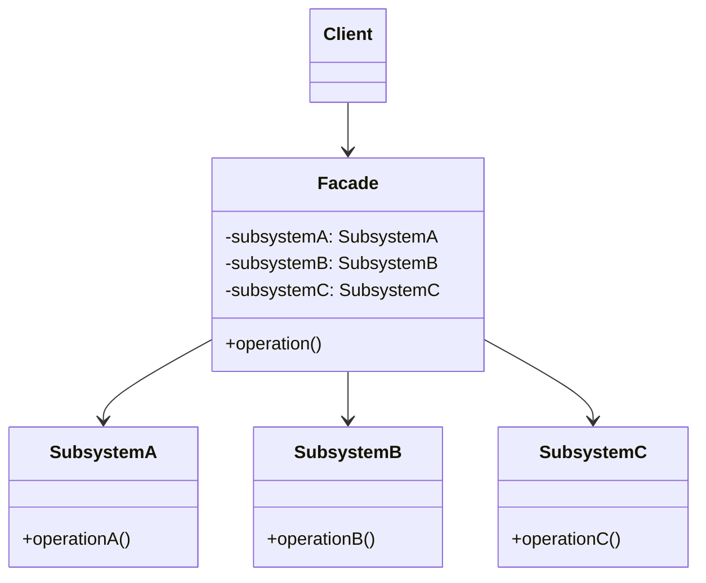
```mermaid
classDiagram
    class Facade {
        -subsystemA: SubsystemA
        -subsystemB: SubsystemB
        -subsystemC: SubsystemC
        +operation()
    }
    class SubsystemA {
        +operationA()
    }
    class SubsystemB {
        +operationB()
    }
    class SubsystemC {
        +operationC()
    }
    class Client

    Facade --> SubsystemA
    Facade --> SubsystemB
    Facade --> SubsystemC
    Client --> Facade
```

**Implementation:** [`Structural/Facade`](Structural/Facade) — `make` → `./app`

---

### Flyweight

**Intent:** Use sharing to support large numbers of fine-grained objects efficiently.

**Example:** A `FlyweightFactory` caches shared `CharacterFlyweight` instances keyed by glyph, reducing memory for repeated characters.

**UML**

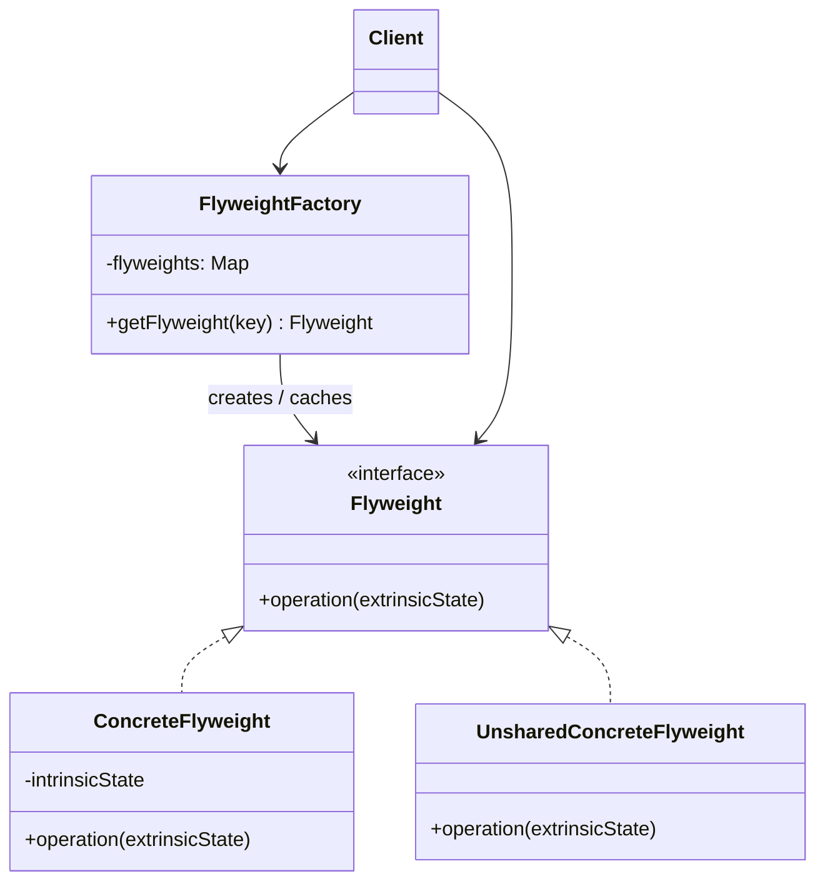
```mermaid
classDiagram
    class Flyweight {
        <<interface>>
        +operation(extrinsicState)
    }
    class ConcreteFlyweight {
        -intrinsicState
        +operation(extrinsicState)
    }
    class UnsharedConcreteFlyweight {
        +operation(extrinsicState)
    }
    class FlyweightFactory {
        -flyweights: Map
        +getFlyweight(key) Flyweight
    }
    class Client

    Flyweight <|.. ConcreteFlyweight
    Flyweight <|.. UnsharedConcreteFlyweight
    FlyweightFactory --> Flyweight : creates / caches
    Client --> FlyweightFactory
    Client --> Flyweight
```

**Implementation:** [`Structural/Flyweight`](Structural/Flyweight) — `make` → `./flyweight`

---

### Proxy

**Intent:** Provide a surrogate or placeholder for another object to control access to it.

**Example:** A `VirtualProxy` lazily creates an expensive `RealObject` on first access and can add access control or logging.

**UML**

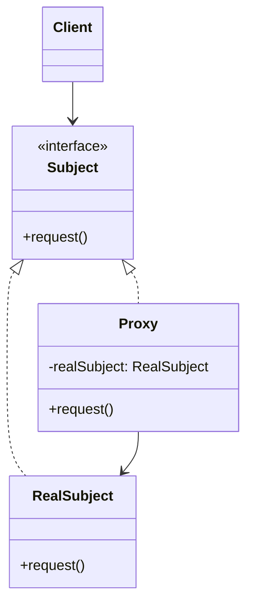
```mermaid
classDiagram
    class Subject {
        <<interface>>
        +request()
    }
    class RealSubject {
        +request()
    }
    class Proxy {
        -realSubject: RealSubject
        +request()
    }
    class Client

    Subject <|.. RealSubject
    Subject <|.. Proxy
    Proxy --> RealSubject
    Client --> Subject
```

**Implementation:** [`Structural/VirtualProxy`](Structural/VirtualProxy) — `make` → `./virtual_proxy`

---

## Behavioral

### Chain of Responsibility

**Intent:** Avoid coupling the sender of a request to its receiver by giving more than one object a chance to handle the request. Pass the request along a chain until an object handles it.

**Example:** Support tickets escalate through L1 → L2 → Senior Engineer → Manager based on type and priority.

**UML**

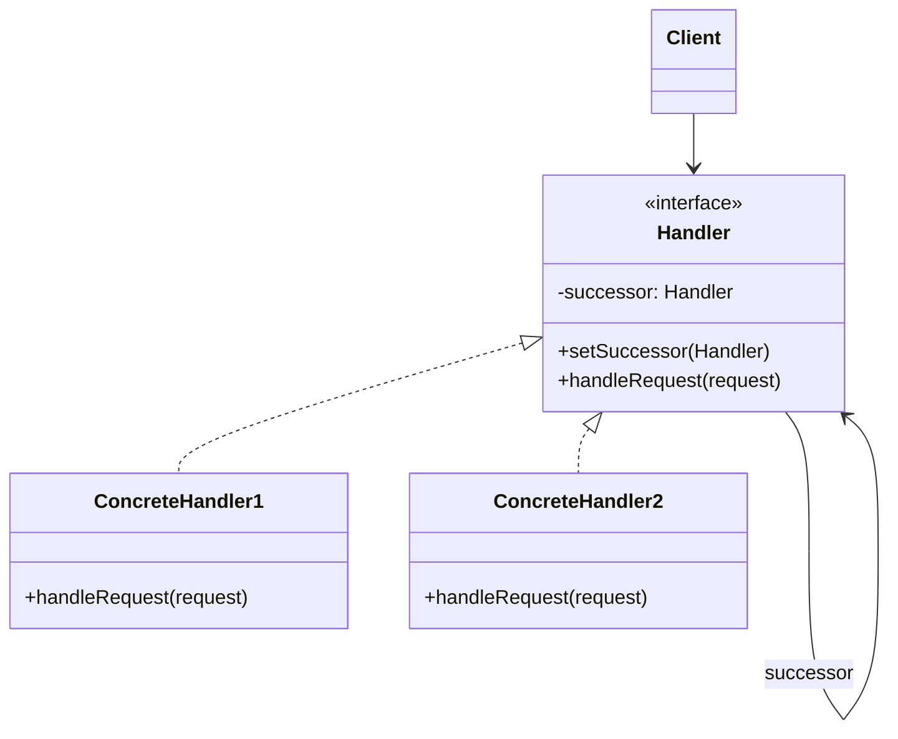
```mermaid
classDiagram
    class Handler {
        <<interface>>
        -successor: Handler
        +setSuccessor(Handler)
        +handleRequest(request)
    }
    class ConcreteHandler1 {
        +handleRequest(request)
    }
    class ConcreteHandler2 {
        +handleRequest(request)
    }
    class Client

    Handler <|.. ConcreteHandler1
    Handler <|.. ConcreteHandler2
    Handler --> Handler : successor
    Client --> Handler
```

**Implementation:** [`Behavioral/ChainOfResponsibility`](Behavioral/ChainOfResponsibility) — `make` → `./chainofresponsability`

---

### Command

**Intent:** Encapsulate a request as an object, letting you parameterize clients, queue or log requests, and support undoable operations.

**Example:** A `RemoteControl` invoker executes `LightOnCommand`, `TVOnCommand`, and `StereoPlayCommand` against device receivers.

**UML**

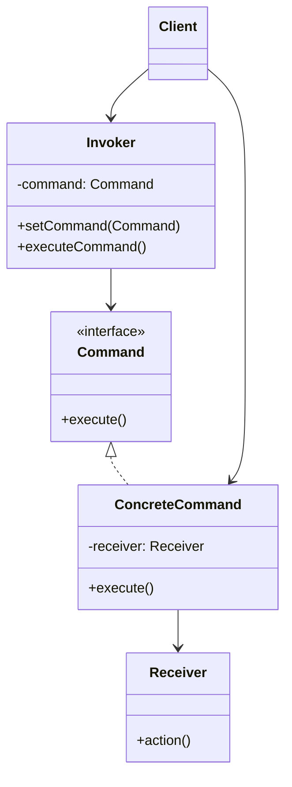
```mermaid
classDiagram
    class Command {
        <<interface>>
        +execute()
    }
    class ConcreteCommand {
        -receiver: Receiver
        +execute()
    }
    class Receiver {
        +action()
    }
    class Invoker {
        -command: Command
        +setCommand(Command)
        +executeCommand()
    }
    class Client

    Command <|.. ConcreteCommand
    ConcreteCommand --> Receiver
    Invoker --> Command
    Client --> ConcreteCommand
    Client --> Invoker
```

**Implementation:** [`Behavioral/Command`](Behavioral/Command) — `make` → `./command`

---

### Interpreter

**Intent:** Given a language, define a representation for its grammar along with an interpreter that uses the representation to interpret sentences in the language.

**Example:** A boolean expression tree (`&&`, `||`, `!`) evaluates variables from a shared `Context`.

**UML**

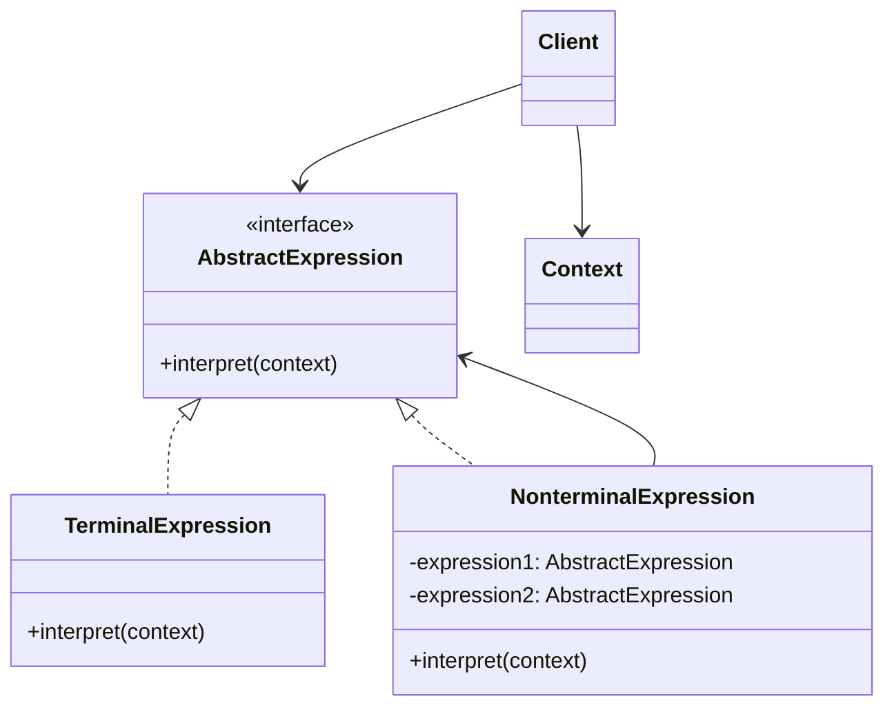
```mermaid
classDiagram
    class AbstractExpression {
        <<interface>>
        +interpret(context)
    }
    class TerminalExpression {
        +interpret(context)
    }
    class NonterminalExpression {
        -expression1: AbstractExpression
        -expression2: AbstractExpression
        +interpret(context)
    }
    class Context
    class Client

    AbstractExpression <|.. TerminalExpression
    AbstractExpression <|.. NonterminalExpression
    NonterminalExpression --> AbstractExpression
    Client --> AbstractExpression
    Client --> Context
```

**Implementation:** [`Behavioral/Interpreter`](Behavioral/Interpreter) — `make` → `./interpreter`

---

### Iterator

**Intent:** Provide a way to access the elements of an aggregate object sequentially without exposing its underlying representation.

**Example:** A `ConcreteIterator` performs inorder traversal over a binary search tree exposed by `Collection`.

**UML**

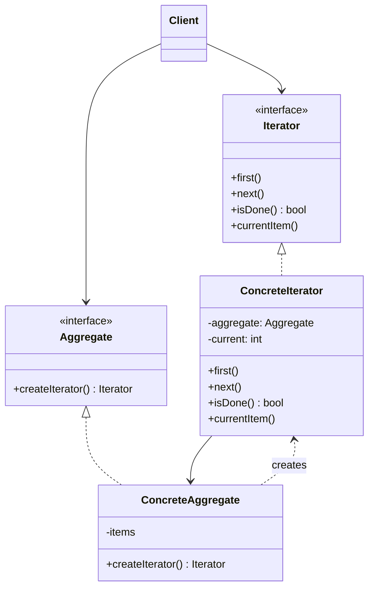
```mermaid
classDiagram
    class Iterator {
        <<interface>>
        +first()
        +next()
        +isDone() bool
        +currentItem()
    }
    class ConcreteIterator {
        -aggregate: Aggregate
        -current: int
        +first()
        +next()
        +isDone() bool
        +currentItem()
    }
    class Aggregate {
        <<interface>>
        +createIterator() Iterator
    }
    class ConcreteAggregate {
        -items
        +createIterator() Iterator
    }
    class Client

    Iterator <|.. ConcreteIterator
    Aggregate <|.. ConcreteAggregate
    ConcreteAggregate ..> ConcreteIterator : creates
    ConcreteIterator --> ConcreteAggregate
    Client --> Iterator
    Client --> Aggregate
```

**Implementation:** [`Behavioral/Iterator`](Behavioral/Iterator) — `make` → `./iterator`

---

### Mediator

**Intent:** Define an object that encapsulates how a set of objects interact. Promote loose coupling by keeping objects from referring to each other explicitly.

**Example:** A `ChatRoom` mediator routes messages between `User` colleagues without direct peer-to-peer references.

**UML**

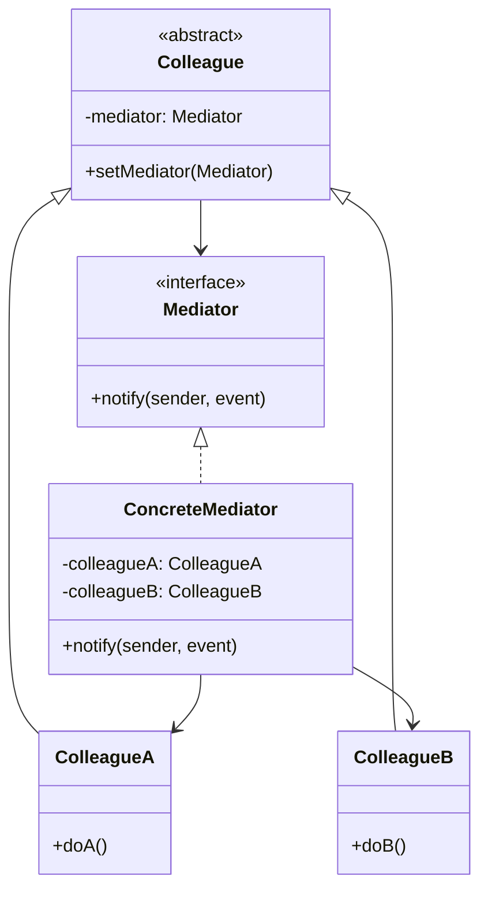
```mermaid
classDiagram
    class Mediator {
        <<interface>>
        +notify(sender, event)
    }
    class ConcreteMediator {
        -colleagueA: ColleagueA
        -colleagueB: ColleagueB
        +notify(sender, event)
    }
    class Colleague {
        <<abstract>>
        -mediator: Mediator
        +setMediator(Mediator)
    }
    class ColleagueA {
        +doA()
    }
    class ColleagueB {
        +doB()
    }

    Mediator <|.. ConcreteMediator
    Colleague <|-- ColleagueA
    Colleague <|-- ColleagueB
    ConcreteMediator --> ColleagueA
    ConcreteMediator --> ColleagueB
    Colleague --> Mediator
```

**Implementation:** [`Behavioral/Mediator`](Behavioral/Mediator) — `make` → `./mediator`

---

### Memento

**Intent:** Without violating encapsulation, capture and externalize an object's internal state so the object can be restored to this state later.

**Example:** A `TextEditor` originator saves snapshots to a `History` caretaker for undo and redo.

**UML**

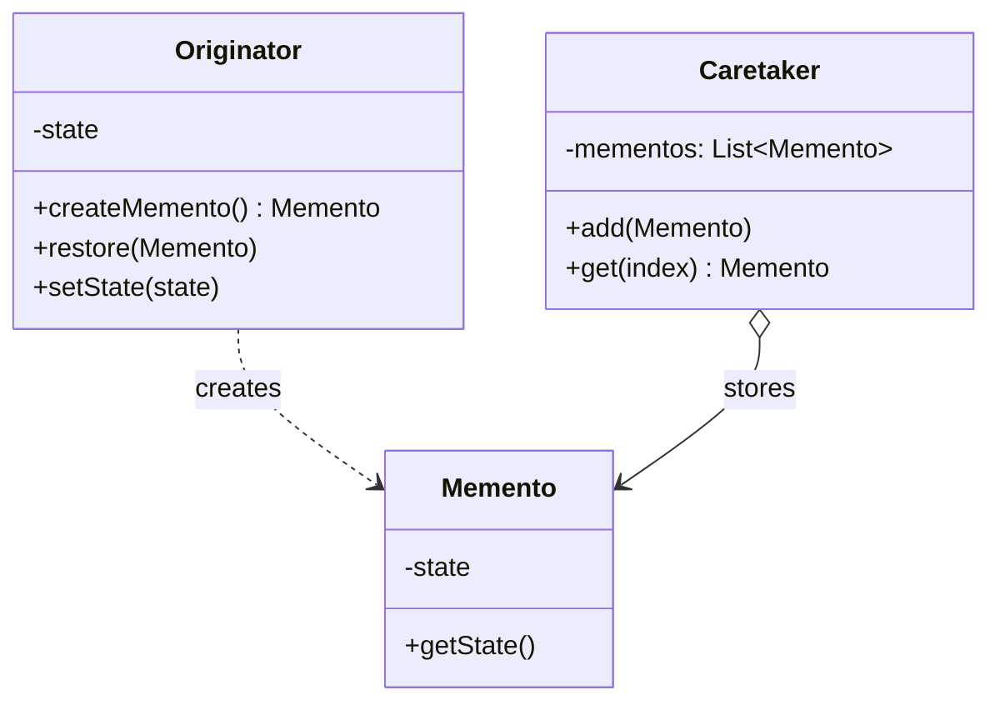
```mermaid
classDiagram
    class Originator {
        -state
        +createMemento() Memento
        +restore(Memento)
        +setState(state)
    }
    class Memento {
        -state
        +getState()
    }
    class Caretaker {
        -mementos: List~Memento~
        +add(Memento)
        +get(index) Memento
    }

    Originator ..> Memento : creates
    Caretaker o--> Memento : stores
```

**Implementation:** [`Behavioral/Memento`](Behavioral/Memento) — `make` → `./memento`

---

### Observer

**Intent:** Define a one-to-many dependency between objects so that when one object changes state, all its dependents are notified and updated automatically.

**Example:** A `ConcreteSubject` notifies attached `ConcreteObserver` instances when its state changes.

**UML**

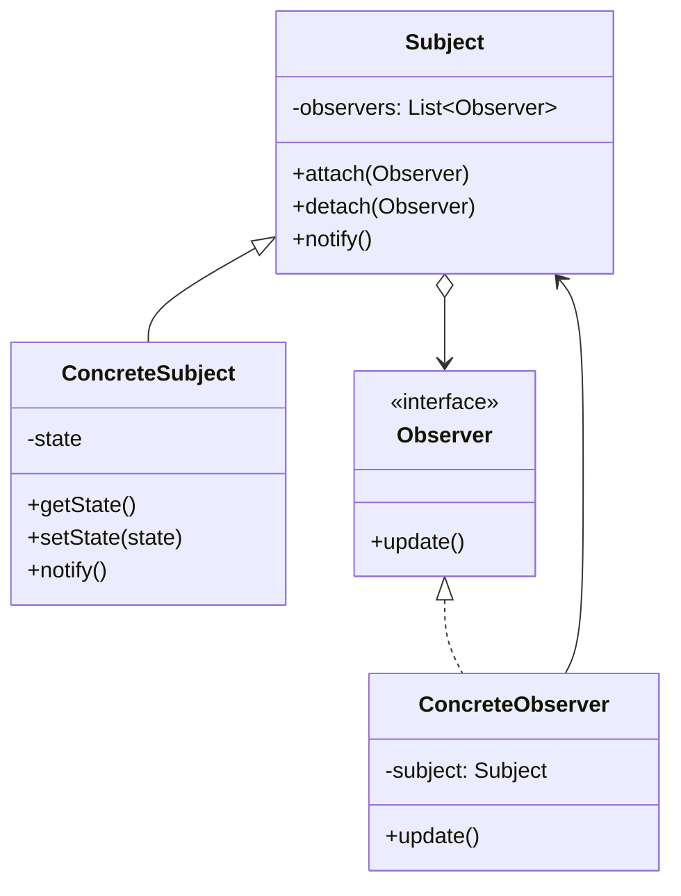
```mermaid
classDiagram
    class Subject {
        -observers: List~Observer~
        +attach(Observer)
        +detach(Observer)
        +notify()
    }
    class ConcreteSubject {
        -state
        +getState()
        +setState(state)
        +notify()
    }
    class Observer {
        <<interface>>
        +update()
    }
    class ConcreteObserver {
        -subject: Subject
        +update()
    }

    Subject <|-- ConcreteSubject
    Observer <|.. ConcreteObserver
    Subject o--> Observer
    ConcreteObserver --> Subject
```

**Implementation:** [`Behavioral/Observer`](Behavioral/Observer) — `make` → `./observer`

---

### State

**Intent:** Allow an object to alter its behavior when its internal state changes. The object will appear to change its class.

**Example:** A `VendingMachine` transitions through Idle → Ready → Sold → SoldOut as the user interacts and stock depletes.

**UML**

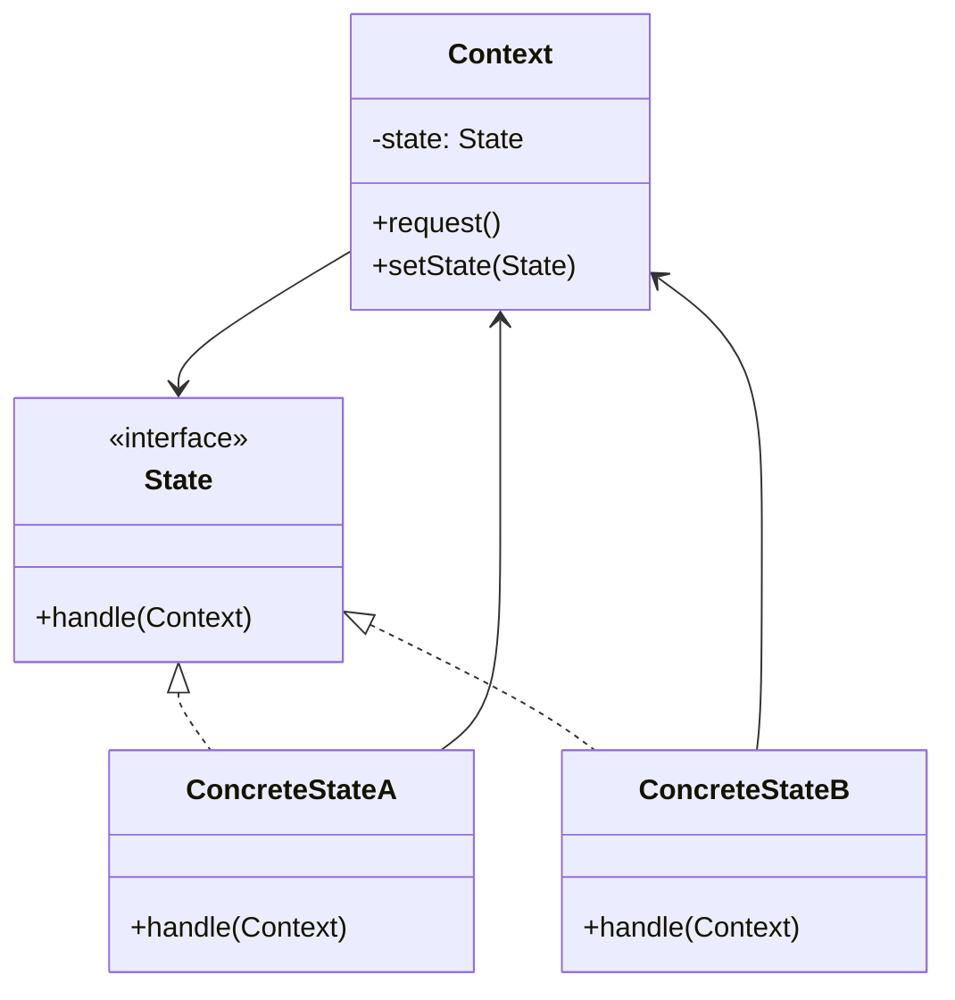
```mermaid
classDiagram
    class Context {
        -state: State
        +request()
        +setState(State)
    }
    class State {
        <<interface>>
        +handle(Context)
    }
    class ConcreteStateA {
        +handle(Context)
    }
    class ConcreteStateB {
        +handle(Context)
    }

    State <|.. ConcreteStateA
    State <|.. ConcreteStateB
    Context --> State
    ConcreteStateA --> Context
    ConcreteStateB --> Context
```

**Implementation:** [`Behavioral/State`](Behavioral/State) — `make` → `./state`

---

### Strategy

**Intent:** Define a family of algorithms, encapsulate each one, and make them interchangeable. Let the algorithm vary independently from clients that use it.

**Example:** An `Account` delegates deposits, withdrawals, and transfers to interchangeable `TransactionStrategy` objects (NVI-style).

**UML**

```mermaid
classDiagram
    class Context {
        -strategy: Strategy
        +setStrategy(Strategy)
        +executeStrategy()
    }
    class Strategy {
        <<interface>>
        +algorithm()
    }
    class ConcreteStrategyA {
        +algorithm()
    }
    class ConcreteStrategyB {
        +algorithm()
    }
    class Client

    Strategy <|.. ConcreteStrategyA
    Strategy <|.. ConcreteStrategyB
    Context --> Strategy
    Client --> Context
    Client --> ConcreteStrategyA
    Client --> ConcreteStrategyB
```

**Implementation:** [`Behavioral/NVI_Strategy`](Behavioral/NVI_Strategy) — `make` → `./banking`

---

### Template Method

**Intent:** Define the skeleton of an algorithm in an operation, deferring some steps to subclasses. Let subclasses redefine certain steps without changing the algorithm's structure.

**Example:** `CaffeineBeverage::prepareRecipe()` brews coffee or tea through shared steps, with a hook to skip condiments for tea.

**UML**

```mermaid
classDiagram
    class AbstractClass {
        +templateMethod()
        +primitiveOperation1()
        +primitiveOperation2()*
        +hook()*
    }
    class ConcreteClass {
        +primitiveOperation2()
        +hook()
    }
    class Client

    AbstractClass <|-- ConcreteClass
    Client --> AbstractClass
```

**Implementation:** [`Behavioral/TemplateMethod`](Behavioral/TemplateMethod) — `make` → `./template_method`

---

### Visitor

**Intent:** Represent an operation to be performed on the elements of an object structure. Let you define a new operation without changing the classes of the elements on which it operates.

**Example:** `PrintVisitor` and `SizeVisitor` traverse a file-system tree of `File`, `Image`, and `Folder` nodes via double dispatch.

**UML**

```mermaid
classDiagram
    class Visitor {
        <<interface>>
        +visitConcreteElementA(ConcreteElementA)
        +visitConcreteElementB(ConcreteElementB)
    }
    class ConcreteVisitor1 {
        +visitConcreteElementA(ConcreteElementA)
        +visitConcreteElementB(ConcreteElementB)
    }
    class ConcreteVisitor2 {
        +visitConcreteElementA(ConcreteElementA)
        +visitConcreteElementB(ConcreteElementB)
    }
    class Element {
        <<interface>>
        +accept(Visitor)
    }
    class ConcreteElementA {
        +accept(Visitor)
        +operationA()
    }
    class ConcreteElementB {
        +accept(Visitor)
        +operationB()
    }
    class ObjectStructure {
        -elements: List~Element~
        +accept(Visitor)
    }

    Visitor <|.. ConcreteVisitor1
    Visitor <|.. ConcreteVisitor2
    Element <|.. ConcreteElementA
    Element <|.. ConcreteElementB
    ObjectStructure o--> Element
    ConcreteElementA ..> Visitor : accept
    ConcreteElementB ..> Visitor : accept
```

**Implementation:** [`Behavioral/Visitor`](Behavioral/Visitor) — `make` → `./visitor`
